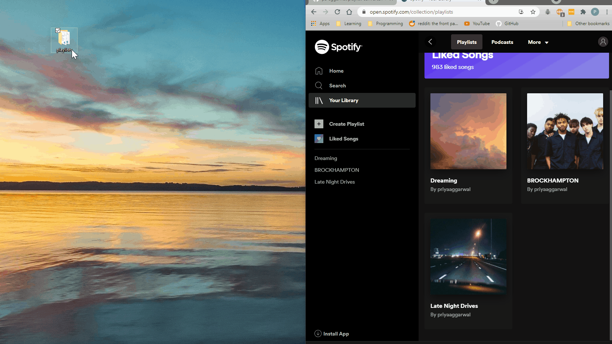

# Playlist Converter

[](https://www.python.org/)
[](./tests)
[](https://opensource.org/licenses/MIT)

Convert a text file of songs to a playlist on your <a href="https://open.spotify.com/">Spotify account</a> or add them to your Liked Songs. Create your playlists faster instead of manually searching for songs.



## Table of Contents

- [Playlist Converter](#playlist-converter)
  - [Table of Contents](#table-of-contents)
  - [How It Works](#how-it-works)
  - [Prerequisites](#prerequisites)
  - [Installation](#installation)
  - [Configuration](#configuration)
  - [Usage](#usage)
    - [Converting Files to Playlists](#converting-files-to-playlists)
      - [File Format](#file-format)
      - [Creating New Playlists](#creating-new-playlists)
      - [Adding to Liked Songs](#adding-to-liked-songs)
    - [Managing Liked Songs](#managing-liked-songs)
    - [Progress and Logging](#progress-and-logging)
    - [Common Issues](#common-issues)
  - [Contributing](#contributing)
  - [License](#license)

## How It Works

* This application reads the contents of every text file in a directory on your computer
* You must provide details of how your files are structured in a configuration file
* Getting a temporary access token from Spotify authorizes this app to access/change your account data
* Using the Python requests library, this application sends the data to Spotify's web API to create playlists or add songs to your Liked Songs

## Prerequisites

* Spotify Account - If you don't have one, create it at [Spotify Signup](https://www.spotify.com/us/signup/)
* Python 3.6+ - Download from [Python.org](https://www.python.org/downloads/)

## Installation

1. Clone this repository:
```bash
git clone https://github.com/DmiShib/spotify-playlist-converter.git
cd playlist-converter
```

2. Create and activate virtual environment:
```bash
python -m venv venv

# Windows
venv\Scripts\activate
# Linux/Mac
source venv/bin/activate
```

3. Install requirements:
```bash
pip install -r requirements.txt
```

4. Set up Spotify Application:
   * Go to [Spotify Developer Dashboard](https://developer.spotify.com/dashboard)
   * Log in with your Spotify account
   * Redirect URIs: `http://localhost:8888/callback`
   * Set the Web API checkbox to true
   * Click "Create an App"
   * Fill in the app name and description
   * Click "Save"
   * Note down your Client ID and Client Secret (you'll need these for config.ini)

5. Create and configure config file:
```bash
cp config/template.ini config/config.ini
```

Edit `config/config.ini` and fill in your Spotify credentials:
```ini
[API]
user_id = your_spotify_username
client_id = your_client_id_from_dashboard
client_secret = your_client_secret_from_dashboard
```

When you first run the application, it will:
1. Open your browser for Spotify authorization
2. Ask you to log in to Spotify (if not already logged in)
3. Request permission to manage your playlists and liked songs
4. Redirect back to the application to complete setup

## Configuration

Edit `config/config.ini` with your settings:

```ini
[FILE_INFO]
directory_path = /path/to/your/music/files
data_order = track artist
data_delimiter = ###

[API]
user_id = your_spotify_username
client_id = your_spotify_client_id
client_secret = your_spotify_client_secret

[DEBUG]
enable_logs = false

[PREFERENCES]
add_to_liked = false
```

Configuration options:
* `directory_path`: Path to folder with your playlist files
* `data_order`: Format of song entries (`track artist` or `artist track`)
* `data_delimiter`: Characters separating track from artist (e.g. `###`, `---`)
* `user_id`: Your Spotify username
* `client_id`: Your Spotify API client ID
* `client_secret`: Your Spotify API client secret
* `enable_logs`: Show detailed logs (true/false)
* `add_to_liked`: Add songs to Liked Songs instead of playlist (true/false)

## Usage

### Converting Files to Playlists

The application can work in two modes: creating new playlists or adding songs to Liked Songs. This is controlled by the `add_to_liked` setting in `config.ini`.

#### File Format
Your text files should contain songs in the following format:
```
Track Name###Artist Name
Another Track###Another Artist
```

Example file `my_playlist.txt`:
```
Bohemian Rhapsody###Queen
Yesterday###The Beatles
Imagine###John Lennon
```

#### Creating New Playlists
1. Set in config.ini:
```ini
[PREFERENCES]
add_to_liked = false
```

2. Place your playlist files in the directory specified in `directory_path`
3. Run the converter:
```bash
python -m playlist_converter.app
```

The application will:
- Create a new private playlist for each text file
- Name the playlist same as the file name (without .txt)
- Search for each song and add it to the corresponding playlist
- Show progress bar for each playlist conversion

#### Adding to Liked Songs
1. Set in config.ini:
```ini
[PREFERENCES]
add_to_liked = true
```

2. Run the converter:
```bash
python -m playlist_converter.app
```

The application will:
- Read all songs from your text files
- Add them directly to your Liked Songs collection
- Show progress bar for the conversion

### Managing Liked Songs

To remove all songs from your Liked Songs collection:
```bash
python -m playlist_converter.clear_liked
```

**⚠️ Warning**: This will remove ALL songs from your Liked Songs. Use with caution!

### Progress and Logging

- For detailed logs about API requests and responses, set `enable_logs = true`
- Without logs enabled, you'll see a progress bar showing conversion status
- After completion, you'll see a success message with the number of tracks processed

### Common Issues
- If authorization fails, ensure your Client ID and Secret are correct
- If songs aren't found, check the track/artist names and delimiter in your files
- If you get API errors, your token might have expired - just run the app again

## Contributing

1. Fork the repository
2. Create your feature branch (`git checkout -b feature/amazing-feature`)
3. Commit your changes (`git commit -m 'Add amazing feature'`)
4. Push to the branch (`git push origin feature/amazing-feature`)
5. Open a Pull Request

## License

Distributed under the MIT License. See `LICENSE` for more information.
